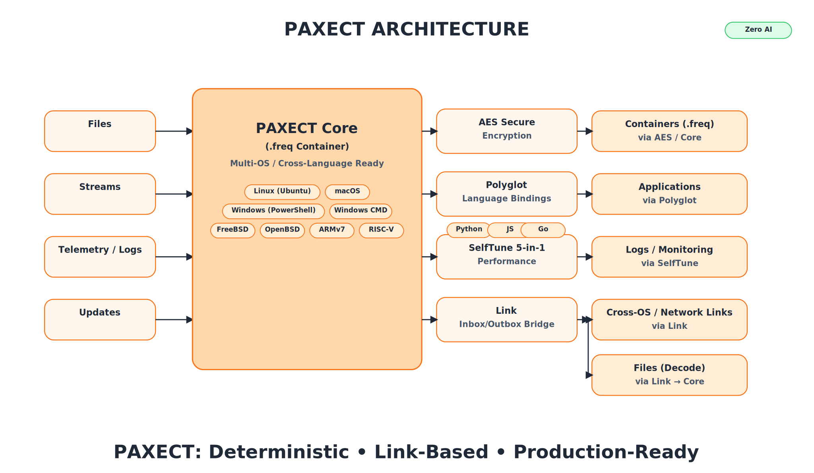

<p align="center">
  
</p>

[](../../stargazers)
[](../../actions)
[](../../actions)
[](../../issues)
[](../../discussions)
[](./SECURITY.md)
[](#)
[](./LICENSE)
<a href="https://github.com/PAXECT-Interface/paxect-selftune-plugin/releases/latest">
  
</a>


---

# PAXECT SelfTune — Cross-Platform Autotune Enterprise Suite

**Status:** v1.0.0 — Initial Public Release — October 22, 2025


A cross-platform, self-tuning engine that combines five adaptive control techniques in one unified module: guard mode, overhead control, logging, smoothing, and self-learning.
Fully deterministic. No AI or heuristic randomness.

Optimized for **Linux, Windows, macOS, FreeBSD, Android, and iOS** 

Plug-and-play with zero dependencies and no vendor lock-in.

---

## Overview

**PAXECT SelfTune** is an enterprise-ready, open-source solution for deterministic performance tuning, automated optimization, and local observability.
It operates fully offline, combining precision control with adaptive runtime learning for consistent optimization across diverse workloads.

### Key Features

* Guard mode with automatic failover
* Dynamic overhead control (default: 75%)
* Deterministic smoothing and logging
* Self-learning without AI or cloud components
* Designed for CI/CD, analytics, and secure offline environments

---

## Demos Included

| Demo | Name                     | Function                                     | Mode  | Status |
| ---- | ------------------------ | -------------------------------------------- | ----- | ------ |
| 1    | Quick Start              | Basic decision logic                         | Local | ✅      |
| 2    | Integration Loop         | Continuous feedback integration              | Local | ✅      |
| 3    | Safety & Manual Cooldown | Fail-safe and manual throttling              | Local | ✅      |
| 4    | Timed Throttle           | 5-minute and 30-minute throttling rules      | Local | ✅      |
| 5    | K8s Runtime Simulation   | Deterministic container workload simulation  | Local | ✅      |
| 6    | Batch File I/O           | Offline optimization for sequential jobs     | Local | ✅      |
| 7    | Dashboard Snapshot       | Export runtime state for dashboard reporting | Local | ✅      |

All demos are portable and run locally on all supported platforms.

---

## Core Capabilities

* **No-AI Policy:** No artificial intelligence, machine learning, or probabilistic models.
* **Deterministic Autotuning:** Ensures predictable, repeatable runtime optimization.
* **Production-Grade Logging:** Every decision recorded with UTC timestamp and full context.
* **Unified 5-in-1 Architecture:** Guard, learn, smooth, throttle, and log within one engine.
* **NumPy Benchmarking:** Uses real matrix multiplication for reproducible CPU performance metrics.
* **Cross-Platform & Lightweight:** Written in pure Python, requires only NumPy.

---

## Architecture Overview

The **5-in-1 deterministic engine** integrates five coordinated control modules that ensure predictable optimization and verifiable performance.

| Module                        | Description                                                      |
| ----------------------------- | ---------------------------------------------------------------- |
| Matrix Benchmarking (NumPy)   | Executes real matrix multiplications for precise runtime metrics |
| Batch Size Autotuning         | Dynamically adjusts block size per iteration                     |
| Automatic Overhead Limitation | Enforces throttle when overhead exceeds configured ratio         |
| Transparent UTC Logging       | Outputs structured logs for full auditability                    |
| I/O Benchmarking              | Measures disk and channel throughput deterministically           |

---

## Installation

**Requirements:**
Python 3.10+ and NumPy ≥ 1.24

```bash
# Install locally in editable mode
pip install -e .

# Install NumPy if not yet available
pip install numpy
```

### Verification

To confirm successful installation and NumPy integration:

```bash
python - <<'PY'
from paxect_selftune_plugin import run_matrix_benchmark
print("NumPy benchmark:", run_matrix_benchmark(128), "seconds")
PY
```

---

## Verification Summary

All seven demos were executed successfully on **Ubuntu 24.04 (x86_64)**, confirming deterministic behavior and cross-platform reproducibility.

| Demo | Title              | Verified Functionality                                       |
| ---- | ------------------ | ------------------------------------------------------------ |
| 01   | Quick Start        | Baseline decision logic with consistent output               |
| 02   | Integration Loop   | Continuous learning feedback under varying conditions        |
| 03   | Safety Throttle    | Automatic fail-safe activation above 75% overhead            |
| 04   | Timed Throttle     | Verified 5-minute and 30-minute cooldown control             |
| 05   | Kubernetes Runtime | Deterministic multi-pod simulation with shared tuning state  |
| 06   | Batch File I/O     | Sequential JSONL batch optimization with reproducible output |
| 07   | Dashboard Snapshot | Export and merge of prior runs into audit-ready metrics      |

**Verification Results:**

* All demos completed deterministically with no runtime drift
* Consistent NumPy benchmark times across all runs
* No external dependencies or non-deterministic components detected

**Test Environments:**

* Ubuntu 24.04 LTS (x86_64)
* Windows 11 Pro (22H2)
* macOS 14 Sonoma

---

## Plugins (official)


| Plugin                         | Scope                           | Highlights                                                                           | Repo                                                                                                                           |
| ------------------------------ | ------------------------------- | ------------------------------------------------------------------------------------ | ------------------------------------------------------------------------------------------------------------------------------ |
| **Core**                       | Deterministic container         | `.freq` v42 · multi-channel · CRC32+SHA-256 · cross-OS · offline · no-AI             | [https://github.com/PAXECT-Interface/paxect-core-plugin.git](https://github.com/PAXECT-Interface/paxect-core-plugin.git)                             |
| **AEAD Hybrid**                | Confidentiality & integrity     | Hybrid AES-GCM/ChaCha20-Poly1305 — fast, zero-dep, cross-OS                          | [https://github.com/PAXECT-Interface/paxect-aead-hybrid-plugin](https://github.com/PAXECT-Interface/paxect-aead-hybrid-plugin) |
| **Polyglot**                   | Language bindings               | Python · Node.js · Go — identical deterministic pipeline                             | [https://github.com/PAXECT-Interface/paxect-polyglot-plugin](https://github.com/PAXECT-Interface/paxect-polyglot-plugin)       |
| **SelfTune 5-in-1**            | Runtime control & observability | No-AI guardrails, overhead caps, backpressure, jitter smoothing, lightweight metrics | [https://github.com/PAXECT-Interface/paxect-selftune-plugin](https://github.com/PAXECT-Interface/paxect-selftune-plugin)       |
| **Link (Inbox/Outbox Bridge)** | Cross-OS file exchange          | Shared-folder relay: auto-encode non-`.freq` → `.freq`, auto-decode `.freq` → files  | [https://github.com/PAXECT-Interface/paxect-link-plugin](https://github.com/PAXECT-Interface/paxect-link-plugin) 


## Path to Paid - Paxect Selftune plugin

**PAXECT** is built to stay free and open-source at its core.  
At the same time, we recognize the need for a sustainable model to fund long-term maintenance and enterprise adoption.

### Principles

- **Core stays free forever** — no lock-in, no hidden fees.  
- **Volunteers and researchers**: always free access to source, builds, and discussions.  
- **Transparency**: clear dates, no surprises.  
- **Fairness**: individuals stay free; organizations that rely on enterprise features contribute financially.

### Timeline

- **Launch phase:** starting from the official **PAXECT product release date**, all modules — including enterprise — will be free for **6 months**.  
- This free enterprise period applies **globally**, not per individual user or download.  
- **30 days before renewal:** a decision will be made whether the free enterprise phase is extended for another 6 months.  
- **Core/baseline model:** always free with updates. The exact definition of this baseline model is still under discussion.

### Why This Matters

- **Motivation:** volunteers know their work has impact and will remain accessible.  
- **Stability:** enterprises get predictable guarantees and funded maintenance.  
- **Sustainability:** ensures continuous evolution without compromising openness.

## Governance & Ownership
- **Ownership:** All PAXECT products and trademarks (PAXECT™ name + logo) remain the property of the Owner.
- **License:** Source code is Apache-2.0; trademark rights are **not** granted by the code license.
- **Core decisions:** Architectural decisions and **final merges** for Core and brand-sensitive repos require **Owner approval**.
- **Contributions:** PRs are welcome and reviewed by maintainers; merges follow CODEOWNERS + branch protection.
- **Naming/branding:** Do not use the PAXECT name/logo for derived projects without written permission; see `TRADEMARKS.md`.


---

## Community & Support

**Have a bug or feature request?**  
[Open an Issue ›](https://github.com/PAXECT-Interface/paxect-selftune-plugin/issues)  
We track all confirmed issues and enhancement proposals there.

**General questions or ideas?**  
[Join the Discussions › Q&A](https://github.com/PAXECT-Interface/paxect-selftune-plugin/discussions)  
We regularly review strong ideas and convert them into Issues so they can ship.

---

## Project Recognition

If **PAXECT SelfTune** helped your research, deployment, or enterprise project,  
please consider giving the repository a [Star on GitHub](https://github.com/PAXECT-Interface/paxect-selftune-plugin/stargazers) —  
it helps others discover the project and supports long-term maintenance.

### 🔄 Updates & Maintenance

PAXECT Selftune Plugin follows an **open contribution model**.

- Updates, bugfixes, and improvements depend on **community and maintainer availability**.
- There is **no fixed release schedule** — stability and determinism are prioritized over speed.
- Enterprises and contributors are encouraged to submit issues or pull requests for any enhancements.
- The project owner focuses on innovation and architectural guidance rather than continuous support.

In short: updates arrive when they are ready — verified, deterministic, and tested across platforms.


---
## Sponsorships & Enterprise Support

PAXECT SelfTune is maintained as a verified plug-and-play enterprise module.  
Sponsorships enable continuous validation, reproducibility testing, and deterministic compliance across Linux, Windows, and macOS platforms.


 **Enterprise Sponsorship Options**
- Infrastructure validation and cross-platform QA  
- CI/CD and performance compliance testing  
- Integration and OEM partnerships  

 **How to get involved**
- [Become a GitHub Sponsor](https://github.com/sponsors/PAXECT-Interface)  
- For enterprise or OEM inquiries: **PAXECT-Team@outlook.com**


---


### Contact

PAXECT-Team@outlook.com  
 [Issues](https://github.com/PAXECT-Interface/paxect-selftune-plugin/issues)  
 [Discussions](https://github.com/PAXECT-Interface/paxect-selftune-plugin/discussions)  


---


Copyright© 2025 PAXECT Systems · Licensed under Apache 2.0
Deterministic autotuning solutions for enterprise automation and runtime optimization.


---
<p align="center">
  
</p>


[](../../stargazers)
[](../../actions)
[](../../actions)
[](../../issues)
[](../../discussions)
[](./SECURITY.md)
[](./LICENSE)
<a href="https://github.com/PAXECT-Interface/paxect-core-complete/releases/latest">
  
</a>

# PAXECT Core Complete
**Status:** v1.0.0 — Initial Public Release — October 22, 2025

**Deterministic, offline-first runtime ecosystem for secure, reproducible, and auditable data pipelines.**  
Cross-platform, self-tuning, and open-source — built for real-world enterprise innovation, digital hygiene, and NIS2-aligned compliance.


---

## Overview

**PAXECT Core Complete** is the official reference implementation of the PAXECT ecosystem.  
It unifies the verified modules — **Core**, **AEAD Hybrid**, **Polyglot**, **SelfTune**, and **Link** —  
into one reproducible, cross-OS runtime featuring **10 integrated demos**, advanced observability,  
and deterministic performance across multiple environments and operating systems.

### Key Highlights
- **Unified Ecosystem:** Combines Core, AEAD Hybrid, SelfTune, Polyglot, and Link into one verified deterministic bundle.  
- **Reproducible Pipelines:** Bit-identical behavior across Linux, macOS, Windows, FreeBSD, Android, and iOS.  
- **Offline-First:** Zero telemetry and no network dependencies — privacy and security by design.  
- **Enterprise-Grade Validation:** Ten reproducible demo pipelines with built-in audit and metrics endpoints.  
- **Zero-AI Runtime:** The SelfTune plugin provides adaptive control without machine learning or heuristics.  
- **Open Source Forever:** Apache-2.0 licensed, transparent governance, and a fair “Path to Paid” sustainability model.

---

## Installation

### Requirements
- **Python 3.9 – 3.12** (recommended 3.11+)
- Works on **Linux**, **macOS**, **Windows**, **FreeBSD**, **OpenBSD**, **Android (Termux)**, and **iOS (Pyto)**.
- No external dependencies or internet connection required — fully offline-first runtime.

### Optional Utilities
Some demos use these standard tools if available:
- `bash` (for `demo_05_link_smoke.sh`)
- `dos2unix` (for normalizing line endings)
- `jq` (for formatting JSON output)

### Install
```bash
git clone https://github.com/PAXECT-Interface/paxect-core-complete.git
cd paxect-core-complete
python3 -m venv venv
source venv/bin/activate      # on Windows: venv\Scripts\activate
pip install -e .
````

Verify the deterministic core import:

```bash
python3 -c "import paxect_core; print('PAXECT Core OK')"
```

Then run any of the integrated demos from the `demos/` folder to validate deterministic reproducibility.

---

## 📁 Repository Structure

```
paxect-core-complete/
├── paxect_core.py
├── paxect_aead_hybrid_plugin.py
├── paxect_polyglot_plugin.py
├── paxect_selftune_plugin.py
├── paxect_link_plugin.py
├── demos/
│   ├── demo_01_quick_start.py
│   ├── demo_02_integration_loop.py
│   ├── demo_03_safety_throttle.py
│   ├── demo_04_metrics_health.py
│   ├── demo_05_link_smoke.sh
│   ├── demo_06_polyglot_bridge.py
│   ├── demo_07_selftune_adaptive.py
│   ├── demo_08_secure_multichannel_aead_hybrid.py
│   ├── demo_09_enterprise_all_in_one.py
│   └── demo_10_enterprise_stability_faults.py
├── test_paxect_all_in_one.py
├── ENTERPRISE_PACK_OVERVIEW.md
├── SECURITY.md
├── CONTRIBUTING.md
├── CODE_OF_CONDUCT.md
├── TRADEMARKS.md
├── LICENSE
└── .gitignore
```

---

## Modules

| Module                           | Purpose                                                           |
| -------------------------------- | ----------------------------------------------------------------- |
| **paxect_core.py**               | Deterministic runtime · encode/decode · CRC32 + SHA-256 checksums |
| **paxect_aead_hybrid_plugin.py** | Hybrid AES-GCM / ChaCha20-Poly1305 encryption for data integrity  |
| **paxect_polyglot_plugin.py**    | Cross-language bridge · UTF-safe transformation between runtimes  |
| **paxect_selftune_plugin.py**    | Adaptive ε-greedy self-tuning · resource-aware control · no AI    |
| **paxect_link_plugin.py**        | Secure inbox/outbox relay · policy validation · offline file sync |




---

## Plugins (Official)

| Plugin                         | Scope                           | Highlights                                                                   | Repo                                                                                       |
| ------------------------------ | ------------------------------- | ---------------------------------------------------------------------------- | ------------------------------------------------------------------------------------------ |
| **Core**                       | Deterministic data container    | `.freq` v42 · multi-channel · CRC32 + SHA-256 · cross-OS · offline-first     | [paxect-core-plugin](https://github.com/PAXECT-Interface/paxect-core-plugin)               |
| **AEAD Hybrid**                | Encryption & Integrity          | Hybrid AES-GCM / ChaCha20-Poly1305 — fast, zero dependencies, cross-platform | [paxect-aead-hybrid-plugin](https://github.com/PAXECT-Interface/paxect-aead-hybrid-plugin) |
| **Polyglot**                   | Multi-language bridge           | Python · Node.js · Go — deterministic pipeline parity                        | [paxect-polyglot-plugin](https://github.com/PAXECT-Interface/paxect-polyglot-plugin)       |
| **SelfTune 5-in-1**            | Runtime control & observability | Guardrails, backpressure, overhead limits, metrics, and jitter smoothing     | [paxect-selftune-plugin](https://github.com/PAXECT-Interface/paxect-selftune-plugin)       |
| **Link (Inbox/Outbox Bridge)** | Cross-OS file exchange          | Shared-folder relay: auto-encode/decode `.freq` containers deterministically | [paxect-link-plugin](https://github.com/PAXECT-Interface/paxect-link-plugin)               |

**Plug-and-play:** Core operates standalone, with optional plugins attachable via flags or config. Deterministic behavior remains identical across environments.

---

## 🧪 Demo Suite (01 – 10)

Run reproducible demos from the repository root:

```bash
python3 demos/demo_01_quick_start.py
python3 demos/demo_02_integration_loop.py
python3 demos/demo_03_safety_throttle.py
python3 demos/demo_04_metrics_health.py
bash    demos/demo_05_link_smoke.sh
python3 demos/demo_06_polyglot_bridge.py
python3 demos/demo_07_selftune_adaptive.py
python3 demos/demo_08_secure_multichannel_aead_hybrid.py
python3 demos/demo_09_enterprise_all_in_one.py
python3 demos/demo_10_enterprise_stability_faults.py
```

All demos generate structured JSON audit logs under `/tmp/`, verifiable through deterministic SHA-256 outputs.

---

## Testing & Verification

Internal `pytest` suites validate core reproducibility.
End-users can rely on the integrated demo suite (01–10) for deterministic verification.
Each demo reports performance, checksum validation, and exit status cleanly.

---

## 🔒 Security & Privacy

* Default mode: **offline**, **zero telemetry**.
* Sensitive configuration via environment variables.
* AEAD Hybrid is simulation-grade; for production, integrate with verified crypto or HSM.
* Adheres to **Digital Hygiene 2027** and **NIS2** security standards.
* Follows responsible disclosure in [`SECURITY.md`](./SECURITY.md).

---

## 🏢 Enterprise Pack

See [`ENTERPRISE_PACK_OVERVIEW.md`](./ENTERPRISE_PACK_OVERVIEW.md)
for extended features and enterprise integration roadmap.

Includes:

* HSM / KMS / Vault integration
* Extended policy and audit engine
* Prometheus, Grafana, Splunk, and Kafka observability connectors
* Deployment assets (systemd, Helm, Docker)
* Compliance documentation (ISO · IEC · NIST · NIS2)

---

## 🤝 Community & Governance

* **License:** Apache-2.0
* **Ownership:** All PAXECT trademarks and brand assets remain property of the Owner.
* **Contributions:** PRs welcome; feature branches must pass deterministic CI pipelines.
* **Core merges:** Require owner approval for brand or architecture-sensitive changes.
* **Community Conduct:** See [`CODE_OF_CONDUCT.md`](./CODE_OF_CONDUCT.md)

Join as a maintainer or contributor — see [`CONTRIBUTING.md`](./CONTRIBUTING.md) for details.

---

## 🔄 Updates & Maintenance

**PAXECT Core Complete** follows an open contribution and verification-first model:

* No fixed release schedule — determinism prioritized over speed.
* Verified updates only, across OSes and environments.
* Maintainers focus on innovation, reproducibility, and architecture quality.

---

## 💠 Sponsorships & Enterprise Support

**PAXECT Core Complete** is a verified, plug-and-play runtime ecosystem unifying all PAXECT modules.
Sponsorships fund ongoing cross-platform validation, reproducibility testing, and audit compliance
for deterministic and secure data pipelines across **Linux**, **Windows**, and **macOS**.

### Enterprise Sponsorship Options

* Infrastructure validation and multi-OS QA
* Deterministic CI/CD performance testing
* OEM and observability integration partnerships
* Extended reproducibility assurance for regulated industries

### Get Involved

* 💠 [Become a GitHub Sponsor](https://github.com/sponsors/PAXECT-Interface)
* 📧 Enterprise or OEM inquiries: **enterprise@[PAXECT-Team@outlook.com](mailto:PAXECT-Team@outlook.com)**

> Sponsorships help sustain open, verifiable, and enterprise-ready innovation.

---

## Governance & Ownership

* **Ownership:** All PAXECT products and trademarks (PAXECT™ name + logo) remain the property of the Owner.
* **License:** Source code under Apache-2.0; trademark rights are **not** granted by the license.
* **Core decisions:** Architectural merges for Core and brand repos require Owner approval.
* **Contributions:** PRs reviewed under CODEOWNERS and branch protection.
* **Brand Use:** Do not use PAXECT branding for derivatives without written permission. See `TRADEMARKS.md`.

---

## Path to Paid — Sustainable Open Source

**PAXECT Core Complete** is free and open-source at its foundation.
Sustainable sponsorship ensures long-term maintenance, reproducibility, and enterprise adoption.

### Principles

* Core remains free forever — no vendor lock-in.
* Full transparency, open changelogs, and audit-ready releases.
* Global 6-month free enterprise window after public release.
* Community-driven decision-making on renewals and roadmap.

### Why This Matters

* Motivates contributors with lasting value.
* Ensures reproducible stability for enterprises.
* Balances open innovation with sustainable funding.

---

### Contact

📧 **[PAXECT-Team@outlook.com](mailto:PAXECT-Team@outlook.com)**
💬 [Issues](https://github.com/PAXECT-Interface/paxect-core-plugin/issues)
💭 [Discussions](https://github.com/PAXECT-Interface/paxect-core-plugin/discussions)

*For security disclosures, please follow responsible reporting procedures.*

Copyright © 2025 **PAXECT Systems** — All rights reserved.


---


<p align="center">
  
</p>


---


<p align="center">
  
</p>


---


<p align="center">
  
</p>


---


<p align="center">
  
</p>


---


<p align="center">
  
</p>


---


<p align="center">
  
</p>


---


<p align="center">
  
</p>


---


<p align="center">
  
</p>


## Keywords & Topics — PAXECT Core Complete v1.0

**PAXECT Core Complete** — a unified, deterministic, offline-first runtime ecosystem for secure, reproducible, cross-platform **data pipelines**.  
It bundles **Core**, **AEAD Hybrid**, **Polyglot**, **SelfTune**, and **Link** into one verifiable, enterprise-grade, zero-telemetry platform —  
built for auditability, reproducibility, and **NIS2-aligned digital hygiene**.

---

### 🧩 Core Ecosystem
paxect-core-complete, paxect-ecosystem, deterministic-runtime, reproducible-pipelines, unified-runtime, cross-platform-framework, open-source-runtime, modular-architecture, reproducibility-engine, digital-hygiene-framework, offline-first-runtime, path-to-paid-open-source

### 🔐 Security & Compliance
secure-data-pipelines, aead-hybrid-encryption, aes-gcm, chacha20-poly1305, integrity-validation, crc32-sha256, privacy-by-design, audit-compliance, enterprise-audit, deterministic-validation, nis2-compliance, iso-iec-nist, reproducibility-assurance, responsible-disclosure, zero-telemetry-security

### ⚙️ Performance & Observability
selftune-runtime, zero-ai-tuning, adaptive-performance, resource-aware-runtime, observability-endpoints, metrics-health, deterministic-ci-cd, cross-os-performance, performance-baseline, reproducible-integration-tests, system-optimization, data-throughput, latency-control, stress-validation

### 🌐 Interoperability & Integration
polyglot-integration, cross-language-runtime, cross-os-support, multi-environment-pipelines, link-bridge, inbox-outbox-relay, deterministic-file-transfer, plugin-ecosystem, hybrid-integration, automation-framework, reproducible-deployment, docker-helm-systemd, ci-cd-pipeline

### 🏢 Enterprise & Sustainability
enterprise-ready, open-source-governance, reproducibility-validation, compliance-audit, sustainable-open-source, reproducible-infrastructure, digital-trust, secure-supply-chain, continuous-validation, transparent-governance, community-driven-innovation, reproducible-enterprise-pipelines

---

## 🔍 Why PAXECT Core Complete Matters

- **Unified ecosystem:** combines Core + Plugins + Enterprise Pack into one deterministic runtime.  
- **Cross-platform reproducibility:** identical results across Linux, macOS, Windows, and BSD.  
- **Offline-first privacy:** zero telemetry, no external dependencies, predictable behavior.  
- **Audit-ready:** CRC32 + SHA-256 verification on every frame, JSON-based audit logs.  
- **Open innovation:** Apache-2.0 license, transparent governance, sustainable roadmap.  

---

## 🚀 Use Cases

- **Regulated enterprises:** reproducible CI/CD pipelines for compliance and audits.  
- **AI / ML ops:** deterministic data packaging and reproducible model delivery.  
- **Edge & IoT:** offline deterministic pipelines for embedded and field devices.  
- **Research & Science:** verifiable experiment packaging, audit-proof reproducibility.  
- **Hybrid Cloud / Multi-OS:** deterministic workflows across distributed environments.

---

## 🧠 SEO Keywords (High Density)

paxect-core-complete, deterministic-runtime, reproducible-pipelines, secure-data-pipelines, aead-hybrid-encryption, selftune-runtime, polyglot-integration, link-bridge, cross-platform-runtime, offline-first, open-source-ecosystem, enterprise-audit, nis2-compliance, digital-hygiene, zero-telemetry, reproducibility-validation, audit-compliance, cross-language, deterministic-ci-cd, reproducible-infrastructure, sustainable-open-source, data-integrity, privacy-by-design, observability, adaptive-performance, audit-ready, enterprise-grade, deterministic-engine, verifiable-pipeline, cross-os-runtime


---
<p align="center">
  
</p>


---
<p align="center">
  
</p>


---
<p align="center">
  
</p>


---
<p align="center">
  
</p>


---
<p align="center">
  
</p>


---
<p align="center">
  
</p>


---
<p align="center">
  
</p>

## Keywords & Topics

**PAXECT SelfTune** — deterministic **5-in-1 runtime control** for predictable performance across systems and workloads: **guardrails**, **overhead caps**, **deterministic smoothing**, **structured logging**, and **local learning**.
Designed for zero-telemetry, **offline** operation across **Linux**, **macOS**, and **Windows** — plug-and-play for CI/CD and enterprise environments.

These keywords improve discoverability on GitHub and search engines:

* **Runtime/Control:** paxect, selftune, deterministic, runtime-control, guardrails, throttling, backpressure, cooldown, jitter-control, stability
* **Observability & Logging:** structured-logging, jsonl, metrics, telemetry-free, audit-trail, utc-logging, reproducible-logs
* **Determinism & Reproducibility:** reproducible, repeatable, deterministic-computing, zero-ai, offline-mode, air-gapped
* **Performance/CI:** overhead-control, performance, optimization, ci-cd, workload-governor, control-plane, reliability
* **Interoperability:** cross-os, cross-platform, linux, windows, macos, android, ios
* **Use Domains:** devops, analytics, batch-processing, edge-computing, scientific-computing, secure-ops
* **PAXECT Ecosystem:** paxect-core, paxect-link, paxect-polyglot, paxect-aead, deterministic-pipeline, audit-ready

## Why PAXECT SelfTune (recap)

* Deterministic **5-in-1** engine: guard · overhead caps · smoothing · logging · local learning
* **Offline/air-gapped** operation: zero telemetry, no heuristics/AI
* Cross-OS ready for CI/CD, analytics, and secure enterprise environments
* Structured **JSONL** logs with UTC timestamps for full auditability

## Use Cases (examples)

* CI/CD guardrails: cap overhead at defined thresholds and enforce cooldown windows
* Batch/ETL stability: deterministic smoothing to reduce jitter and spikes
* Edge/air-gapped deployments: local learning without network or cloud
* Performance SLOs: predictable throttling/backpressure under load

## Integration (ecosystem overview)

* **Core:** deterministic `.freq` v42 container (CRC32 + SHA-256 integrity)
* **Link:** inbox/outbox bridge for deterministic file hand-offs
* **Polyglot:** language bindings (Python/Node/Go) for cross-runtime workflows
* **AEAD Hybrid:** optional encryption layer for confidential pipelines
* All components adhere to deterministic contracts (reproducible, audit-ready).

## License, Community & Contact

* **License:** Apache-2.0
* **Community:** GitHub Discussions & Issues
* **Support:** enterprise@[paxect-team@outlook.com](mailto:paxect-team@outlook.com)
* **Security:** no telemetry, fully offline and auditable.

---

### ✅ Launch Summary — October 2025

**Status:** Production-ready · Cross-OS verified · Deterministic runtime control
All 7 demos validated on Ubuntu 24.04 LTS, Windows 11 Pro, and macOS 14 Sonoma.
Consistent runtime behavior confirmed across workloads.
Fully compatible with **PAXECT Core v42** and related plugins (Link, Polyglot, AEAD).
Zero-AI verified: deterministic control only — no heuristics, no telemetry.

---

<!--
GitHub Topics:
paxect selftune deterministic runtime-control guardrails throttling backpressure cooldown
smoothing jitter-control logging observability jsonl audit-trail zero-ai offline air-gapped
cross-os performance ci-cd reproducible reproducibility devops analytics edge-computing
paxect-core paxect-link paxect-polyglot paxect-aead deterministic-computing pipeline

Keywords:
PAXECT SelfTune, deterministic runtime control, guard mode, overhead caps,
deterministic smoothing, structured logging, local learning,
offline control-plane, zero telemetry, CI/CD guardrails, cross-OS performance,
reproducible systems, audit-ready logs, deterministic computing
-->

✅ **Deterministic · Offline · Zero-AI**

© 2025 PAXECT Systems. Deterministic runtime control for the modern enterprise.

